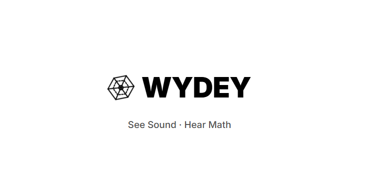

# Wydey

  

Welcome to **Wydey**, an interactive, open-source educational tool that seamlessly bridges mathematics and music! Wydey allows users to visualize mathematical functions in stunning 2D and 3D graphs while simultaneously generating audio representations based on those functions.

## What is Wydey?

Wydey is a progressive web application designed to map mathematical functions to geometric visualizations and audio samples. By translating abstract equations into visual formats and pairing them with instrument sounds (like Piano, Violin, Synth, and Flute), Wydey makes exploring mathematics a multisensory experience. 

## Key Features
- **Dynamic Graphing**: Plot multiple mathematical expressions concurrently in beautiful, high-contrast 2D and 3D spaces using robust mathematical rendering.
- **Audio Synthesis (Sonification)**: Listen to your equations! The built-in audio engine maps the values of your functions to musical notes and synthesized instruments.
- **Audio Recording**: The calculator also acts as a custom sound recorder, allowing users to capture their graphed audio sweeps and download them instantly as high-fidelity `.webm` audio files.
- **Multisensory Learning**: Engage with functions both visually and aurally for a deeper understanding of mathematical concepts.
- **Integrated Equation Keyboard**: Built-in math keyboard for fast and easy input of complex functions and trigonometric operations.
- **Interactive 3D Views**: Switch seamlessly between 2D continuous line graphs and 3D surface plot renderings.

## Use Cases: A Powerful Resource for Educators
Wydey is uniquely positioned as an excellent resource for educators, students, and hobbyists alike:
- **Math Classrooms**: Help students intuitively grasp concepts like wave equations, frequency, amplitude, and trigonometry by showing them how a `sin(x)` curve literally *sounds* different from a complex polynomial.
- **Music & Audio Engineering**: Teach the mathematical foundations of sound waves, oscillators, and synthesizers. 
- **STEM Engagement**: Provide a fun, interactive sandbox for students to play around with math, reducing the intimidation factor often associated with algebra and calculus.
- **Accessibility**: Offers an alternative way to perceive mathematical functions via audio, aiding those who may benefit from auditory learning or different sensory learning models.

## Under Construction
Wydey is currently an active work-in-progress and **under construction**! We are continuously working on adding new features, improving the audio engine, refining the UI, and expanding our 3D visualizations.

**Your feedback is incredibly valuable to us!** If you have ideas, suggestions, or spot a bug, please let us know. 

## Contributing (Please Fork!)
We would love your help to make Wydey even better! If you are a developer, designer, or educator who wants to contribute, please feel free to fork the repository and work on it.

1. **Fork the repository** to start working on it.
2. Create a feature branch (`git checkout -b feature/AmazingFeature`)
3. Commit your changes (`git commit -m 'Add some AmazingFeature'`)
4. Push to the branch (`git push origin feature/AmazingFeature`)
5. Open a Pull Request!

Feedback and pull requests are warmly welcomed. Let's make learning math fun and audible together!

## Tech Stack
- **Frontend Framework**: React
- **Math Engine**: Math.js
- **Audio Synthesis**: Tone.js (via Web Audio API)
- **Visualization**: Mafs / React-Plotly
- **Styling**: Vanilla CSS

---
*Wydey - Hear the Math, See the Sound.*
